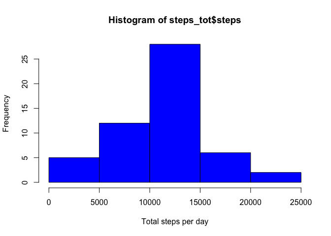
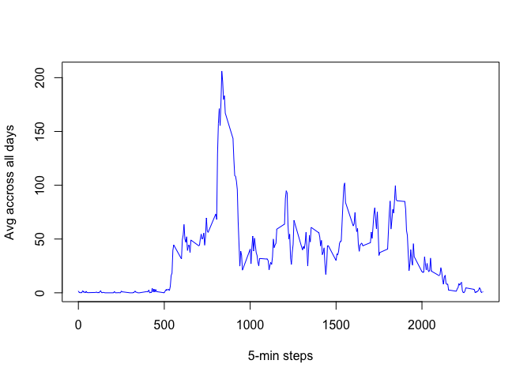
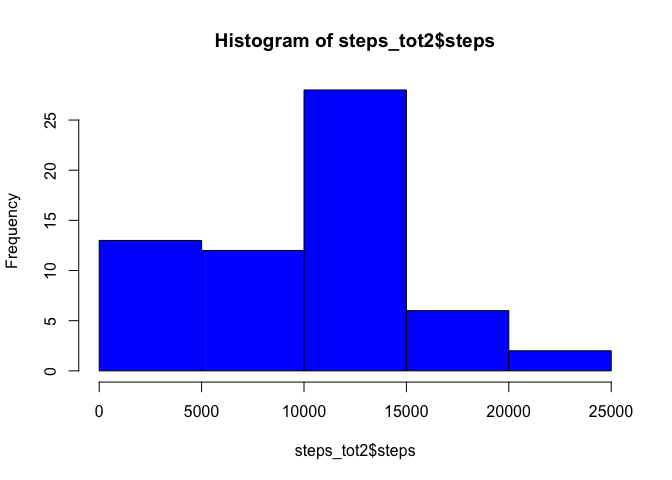
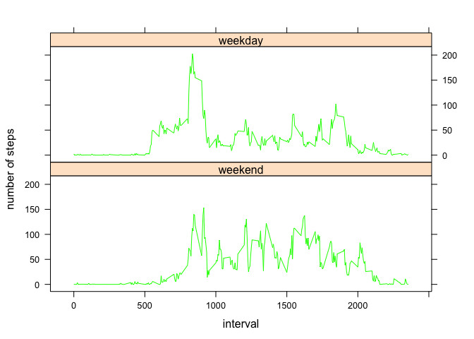

    #load libraries 
    library(dplyr)
    library(lattice)

#### Loading and preprocessing the data

    mydata <- read.csv("activity.csv")
    #view the class
    class(mydata)

    ## [1] "data.frame"

    #View its dimension 
    dim(mydata)

    ## [1] 17568     3

    #look at column nammes
    names(mydata)

    ## [1] "steps"    "date"     "interval"

    #structure of mydata
    str(mydata)

    ## 'data.frame':    17568 obs. of  3 variables:
    ##  $ steps   : int  NA NA NA NA NA NA NA NA NA NA ...
    ##  $ date    : Factor w/ 61 levels "2012-10-01","2012-10-02",..: 1 1 1 1 1 1 1 1 1 1 ...
    ##  $ interval: int  0 5 10 15 20 25 30 35 40 45 ...

    #View structure of activity, the dplyr way
    glimpse(mydata)

    ## Observations: 17,568
    ## Variables: 3
    ## $ steps    <int> NA, NA, NA, NA, NA, NA, NA, NA, NA, NA, NA, NA, NA, N...
    ## $ date     <fctr> 2012-10-01, 2012-10-01, 2012-10-01, 2012-10-01, 2012...
    ## $ interval <int> 0, 5, 10, 15, 20, 25, 30, 35, 40, 45, 50, 55, 100, 10...

    # View a useful summary of each column
    summary(mydata)

    ##      steps                date          interval     
    ##  Min.   :  0.00   2012-10-01:  288   Min.   :   0.0  
    ##  1st Qu.:  0.00   2012-10-02:  288   1st Qu.: 588.8  
    ##  Median :  0.00   2012-10-03:  288   Median :1177.5  
    ##  Mean   : 37.38   2012-10-04:  288   Mean   :1177.5  
    ##  3rd Qu.: 12.00   2012-10-05:  288   3rd Qu.:1766.2  
    ##  Max.   :806.00   2012-10-06:  288   Max.   :2355.0  
    ##  NA's   :2304     (Other)   :15840

    #View the top
    head(mydata)

    ##   steps       date interval
    ## 1    NA 2012-10-01        0
    ## 2    NA 2012-10-01        5
    ## 3    NA 2012-10-01       10
    ## 4    NA 2012-10-01       15
    ## 5    NA 2012-10-01       20
    ## 6    NA 2012-10-01       25

    #View the bottom
    tail(mydata)

    ##       steps       date interval
    ## 17563    NA 2012-11-30     2330
    ## 17564    NA 2012-11-30     2335
    ## 17565    NA 2012-11-30     2340
    ## 17566    NA 2012-11-30     2345
    ## 17567    NA 2012-11-30     2350
    ## 17568    NA 2012-11-30     2355

    #estimate the % of missing data
    mean(is.na(mydata$steps))

    ## [1] 0.1311475

    #13 % missing value is that important ? See below for answer

What is mean total number of steps taken per day?
-------------------------------------------------

#### 1. Calculate the total number of steps taken per day

    #aggregate : Total number of steps taken per day. NA are omitted by default
    steps_tot <- aggregate(steps ~ date, mydata, sum)
    steps_tot 

    ##          date steps
    ## 1  2012-10-02   126
    ## 2  2012-10-03 11352
    ## 3  2012-10-04 12116
    ## 4  2012-10-05 13294
    ## 5  2012-10-06 15420
    ## 6  2012-10-07 11015
    ## 7  2012-10-09 12811
    ## 8  2012-10-10  9900
    ## 9  2012-10-11 10304
    ## 10 2012-10-12 17382
    ## 11 2012-10-13 12426
    ## 12 2012-10-14 15098
    ## 13 2012-10-15 10139
    ## 14 2012-10-16 15084
    ## 15 2012-10-17 13452
    ## 16 2012-10-18 10056
    ## 17 2012-10-19 11829
    ## 18 2012-10-20 10395
    ## 19 2012-10-21  8821
    ## 20 2012-10-22 13460
    ## 21 2012-10-23  8918
    ## 22 2012-10-24  8355
    ## 23 2012-10-25  2492
    ## 24 2012-10-26  6778
    ## 25 2012-10-27 10119
    ## 26 2012-10-28 11458
    ## 27 2012-10-29  5018
    ## 28 2012-10-30  9819
    ## 29 2012-10-31 15414
    ## 30 2012-11-02 10600
    ## 31 2012-11-03 10571
    ## 32 2012-11-05 10439
    ## 33 2012-11-06  8334
    ## 34 2012-11-07 12883
    ## 35 2012-11-08  3219
    ## 36 2012-11-11 12608
    ## 37 2012-11-12 10765
    ## 38 2012-11-13  7336
    ## 39 2012-11-15    41
    ## 40 2012-11-16  5441
    ## 41 2012-11-17 14339
    ## 42 2012-11-18 15110
    ## 43 2012-11-19  8841
    ## 44 2012-11-20  4472
    ## 45 2012-11-21 12787
    ## 46 2012-11-22 20427
    ## 47 2012-11-23 21194
    ## 48 2012-11-24 14478
    ## 49 2012-11-25 11834
    ## 50 2012-11-26 11162
    ## 51 2012-11-27 13646
    ## 52 2012-11-28 10183
    ## 53 2012-11-29  7047

#### 2. Make a histogram of the total number of steps taken each day

    #Histogram of the total number of steps taken each day 
    hist(steps_tot$steps, xlab="Total steps per day", col="blue")

#### 3. Calculate and report the mean and median of the total number of steps taken per day

    #Mean of total number of steps taken each day 
    mean(steps_tot$steps)

    ## [1] 10766.19

    #Median of total number of steps taken each day 
    median(steps_tot$steps)

    ## [1] 10765

What is the average daily activity pattern?
-------------------------------------------

#### 1. Make a time series plot (i.e. 𝚝𝚢𝚙𝚎 = "𝚕") of the 5-minute interval (x-axis) and the average number of steps taken, averaged across all days (y-axis)

    #dataframe time series of the 5 minute interval
    df <- tapply(mydata$steps, mydata$interval, mean, na.rm=T)
    plot(row.names(df), df, col='blue', type='l', 
         xlab="5-min steps", 
         ylab="Avg accross all days")

#### 2. Which 5-minute interval, on average across all the days in the dataset, contains the maximum number of steps?

    #Max of total number of steps taken each day
    agg <- aggregate(steps ~ date , mydata, max)
    five_mn<- left_join(agg, mydata)

    ## Joining, by = c("date", "steps")

    frequent_5mn <- five_mn$interval[duplicated(five_mn$interval)]
    # Create a function to return the mode of a vector
    getmode <- function(v) {
      uniqv <- unique(v)
      uniqv[which.max(tabulate(match(v, uniqv)))]
    }

    frequent_5mn <- getmode(frequent_5mn)
    frequent_5mn

    ## [1] 815

Imputing missing values
-----------------------

#### 1. Calculate and report the total number of missing values in the dataset (i.e. the total number of rows with 𝙽𝙰s

    sum(is.na(mydata))

    ## [1] 2304

#### 2. Devise a strategy for filling in all of the missing values in the dataset. The strategy does not need to be sophisticated. For example, you could use the mean/median for that day, or the mean for that 5-minute interval, etc.

##### . Analyis of the data shows that we have 2304 NA, which corresponds exactly to 8 days of missing datas (8x288). As these NA matches specific days, they will be replace by zeoros.

    test_na <- unique(mydata[rowSums(is.na(mydata)) > 0, ]$date)
    test_na

    ## [1] 2012-10-01 2012-10-08 2012-11-01 2012-11-04 2012-11-09 2012-11-10
    ## [7] 2012-11-14 2012-11-30
    ## 61 Levels: 2012-10-01 2012-10-02 2012-10-03 2012-10-04 ... 2012-11-30

#### 3. Create a new dataset that is equal to the original dataset but with the missing data filled in.

    # fill NA with zeros
    mydata2 <- mydata
    for (i in test_na){
        index1 <- which(mydata$date == i)
        #set NA to 0 if data for the day are missing
        mydata2[index1, 1] <- 0
    }

#### 4. Make a histogram of the total number of steps taken each day and Calculate and report the mean and median total number of steps taken per day. Do these values differ from the estimates from the first part of the assignment? What is the impact of imputing missing data on the estimates of the total daily number of steps?

    #Histogram of the total number of steps taken each day 
    steps_tot2 <- aggregate(steps ~ date, mydata2, sum)
    steps_tot2

    ##          date steps
    ## 1  2012-10-01     0
    ## 2  2012-10-02   126
    ## 3  2012-10-03 11352
    ## 4  2012-10-04 12116
    ## 5  2012-10-05 13294
    ## 6  2012-10-06 15420
    ## 7  2012-10-07 11015
    ## 8  2012-10-08     0
    ## 9  2012-10-09 12811
    ## 10 2012-10-10  9900
    ## 11 2012-10-11 10304
    ## 12 2012-10-12 17382
    ## 13 2012-10-13 12426
    ## 14 2012-10-14 15098
    ## 15 2012-10-15 10139
    ## 16 2012-10-16 15084
    ## 17 2012-10-17 13452
    ## 18 2012-10-18 10056
    ## 19 2012-10-19 11829
    ## 20 2012-10-20 10395
    ## 21 2012-10-21  8821
    ## 22 2012-10-22 13460
    ## 23 2012-10-23  8918
    ## 24 2012-10-24  8355
    ## 25 2012-10-25  2492
    ## 26 2012-10-26  6778
    ## 27 2012-10-27 10119
    ## 28 2012-10-28 11458
    ## 29 2012-10-29  5018
    ## 30 2012-10-30  9819
    ## 31 2012-10-31 15414
    ## 32 2012-11-01     0
    ## 33 2012-11-02 10600
    ## 34 2012-11-03 10571
    ## 35 2012-11-04     0
    ## 36 2012-11-05 10439
    ## 37 2012-11-06  8334
    ## 38 2012-11-07 12883
    ## 39 2012-11-08  3219
    ## 40 2012-11-09     0
    ## 41 2012-11-10     0
    ## 42 2012-11-11 12608
    ## 43 2012-11-12 10765
    ## 44 2012-11-13  7336
    ## 45 2012-11-14     0
    ## 46 2012-11-15    41
    ## 47 2012-11-16  5441
    ## 48 2012-11-17 14339
    ## 49 2012-11-18 15110
    ## 50 2012-11-19  8841
    ## 51 2012-11-20  4472
    ## 52 2012-11-21 12787
    ## 53 2012-11-22 20427
    ## 54 2012-11-23 21194
    ## 55 2012-11-24 14478
    ## 56 2012-11-25 11834
    ## 57 2012-11-26 11162
    ## 58 2012-11-27 13646
    ## 59 2012-11-28 10183
    ## 60 2012-11-29  7047
    ## 61 2012-11-30     0

    hist(steps_tot2$steps, col='blue')

    #Mean of total number of steps taken each day 
    mean(steps_tot2$steps)

    ## [1] 9354.23

    #Median of total number of steps taken each day 
    median(steps_tot2$steps)

    ## [1] 10395

\#\#\#.Do these values differ from the estimates from the first part of
the assignment? What is the impact of imputing missing data on the
estimates of the total daily number of steps? Average and median values
have changed. As a result the probability distribution of the steps is
impacted.Based on the histogram, the lower tail is little bit skew with
the missing values added.

Are there differences in activity patterns between weekdays and weekends?
-------------------------------------------------------------------------

#### 1.Create a new factor variable in the dataset with two levels – “weekday” and “weekend” indicating whether a given date is a weekday or weekend day.

    mydata2$date <- as.Date(mydata2$date)
    #create a vector of weekdays
    weekdays1 <- c('Monday', 'Tuesday', 'Wednesday', 'Thursday', 'Friday')
    #convert to `factor` and specify the `levels/labels`
    mydata2$wDay <- factor((weekdays(mydata2$date) %in% weekdays1), 
                           levels=c(FALSE, TRUE), labels=c('weekend', 'weekday')) 

Make a panel plot containing a time series plot (i.e. 𝚝𝚢𝚙𝚎 = "𝚕") of the
5-minute interval (x-axis) and the average number of steps taken,
averaged across all weekday days or weekend days (y-axis). data.

    #calculate average accross all days or weekend
    steps_count <- aggregate(steps ~ interval + wDay, data = mydata2, mean)
    names(steps_count) <- c("interval", "wDay", "steps")
      
    xyplot(steps ~ interval | wDay, steps_count, type = "l", layout = c(1, 2), 
             xlab = "interval", ylab = "number of steps", col='green')

